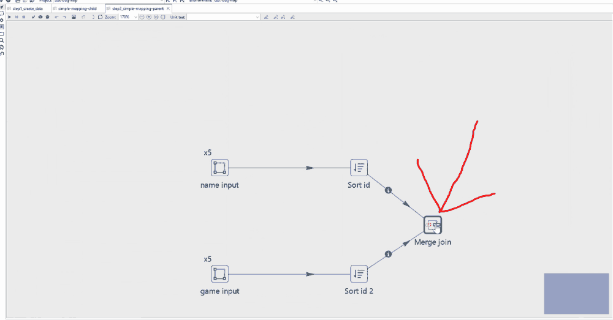

I tested on Apache Hop 2.14.0  
1. Let's open the file step1_create_data.hpl and run it to create a dataset with "Fake data" first
2. Then open the file step2_simple-mapping-parent by using the "Preview output" method for my machine. Then I tried to change to the method of running in the real run mode with the Play button. I got an error

